# Introduction

Voice assistants have become ubiquitous, but most rely on cloud services for speech recognition and language understanding. This post explores [a fully local voice assistant](https://github.com/VigneshSrinivasan10/assistants) designed specifically for **edge devices** - running entirely without cloud dependencies.

The key insight is that modern quantized models have become efficient enough to run real-time voice interactions on modest hardware. No GPU required.

# Edge Device Setup

The system was developed and tested on the following hardware:

| Spec | Value |
|------|-------|
| CPU | AMD Ryzen 7 5825U (Zen 3, 15W TDP) |
| Cores/Threads | 8 cores / 16 threads |
| Clock | 2.0 GHz base, 4.5 GHz boost |
| Cache | L3: 16 MiB |
| RAM | 32 GB DDR4 |
| GPU | None (CPU-only setup) |

All models run on **CPU only**. This makes the system portable to any x86 edge device with sufficient RAM (~8GB minimum for the full stack).

# Architecture

The voice assistant follows a pipeline architecture with intelligent routing:

```mermaid
flowchart LR
    subgraph Input
        A[🎤 User Audio]
    end

    subgraph "Speech Processing"
        B[VAD<br/>Silero]
        C[STT<br/>Whisper small.en]
    end

    subgraph "Intent Routing"
        D[Router<br/>Rule-based]
        E[Weather Handler<br/>priority: 10]
        S[Spotify Handler<br/>priority: 20]
        F[LLM Fallback<br/>Mistral 7B Q4_K_M]
        G[Conversation<br/>Memory]
    end

    subgraph "Audio Output"
        H[TTS<br/>Kokoro ONNX]
        I[🔊 Speaker]
    end

    subgraph "External Services"
        SP[Spotify API]
    end

    A --> B --> C --> D
    D --> E --> H
    D --> S --> SP
    S --> H
    D --> F --> H
    F <--> G
    H --> I
```



The flow is straightforward:
1. **Audio capture** via WebRTC
2. **Voice Activity Detection** filters silence
3. **Speech-to-Text** transcribes the utterance
4. **Router** dispatches to handlers or LLM
5. **Text-to-Speech** generates the response audio

# Components Deep Dive

## STT with VAD

The speech pipeline uses a two-stage approach:

**Silero VAD** (via fastrtc) performs voice activity detection, only forwarding audio chunks that contain speech. This reduces unnecessary STT processing and improves responsiveness.

**Whisper small.en** (via fastrtc_whisper_cpp) handles transcription. The English-only small model provides a good balance of accuracy and speed for edge deployment. The whisper.cpp backend enables efficient CPU inference.

**STT is the main bottleneck** in this pipeline. It's the primary interface to the human - the user is waiting for their speech to be understood before anything else can happen. Everything downstream (routing, LLM inference, TTS) is automation that processes in sequence. Optimizing STT latency has the most direct impact on perceived responsiveness.

## Router with Handler Registry

The router implements a **simple rule-based handler registry pattern**. Each handler registers with a priority value and a matching function (typically keyword-based):

```
Router (Rule-based)
  ├── WeatherHandler (priority: 10)
  │     └── Matches: "weather", "temperature", "forecast"
  ├── SpotifyHandler (priority: 20)
  │     └── Matches: "play", "pause", "skip", "music"
  └── LLM Fallback (priority: lowest)
        └── Handles: everything else
```

Handlers are checked in priority order. The first matching handler processes the request. If no handler matches, the query falls through to the LLM.

This design allows:
- Fast responses for common queries (weather, music control, etc.)
- Easy extension with new handlers
- LLM as a catch-all for open-ended conversation

**Why rule-based?** On edge devices with limited compute, a simple keyword matcher is nearly instantaneous. It handles the common cases (80% of queries) without invoking the LLM.

**Alternative: LLM as router.** With more compute budget, you could use a smaller LLM (or the same LLM with a routing prompt) to classify intent. This provides better understanding of ambiguous queries but adds latency. For cloud deployments or beefier edge hardware, this trade-off may be worthwhile.

## LLM (Mistral 7B)

The LLM backend uses **llama-cpp-python** with **Mistral 7B Q4_K_M** quantization. Key characteristics:

- **Q4_K_M quantization**: ~4.4GB model size, minimal quality loss
- **Context window**: Maintains conversation history
- **CPU inference**: Runs on the Zen 3 cores with AVX2 acceleration

The **ConversationMemory** component persists chat history to JSON, enabling context-aware responses across sessions.

## TTS (Kokoro)

**Kokoro ONNX** (via fastrtc) generates natural-sounding speech. The ONNX runtime enables efficient CPU inference with the quantized voice model.

# Why Edge?

Running locally on edge devices provides several advantages:

**Privacy**: Audio never leaves the device. No cloud transcription, no data retention policies to worry about.

**Latency**: No network round-trips. Response time depends only on local compute. On the test hardware, end-to-end latency is acceptable for conversational interaction.

**Offline Capability**: Works without internet connectivity. Essential for embedded systems, industrial settings, or areas with unreliable connectivity.

**Cost**: No API fees, no usage limits. One-time hardware cost.

# Key Technologies

| Component | Technology | Size/Notes |
|-----------|------------|------------|
| VAD | Silero VAD | ~2 MB |
| STT | Whisper small.en | ~500 MB |
| Router | Handler Registry | Custom pattern |
| LLM | Mistral 7B Q4_K_M | ~4.4 GB |
| TTS | Kokoro ONNX | ~100 MB |
| Memory | ConversationMemory | JSON persistence |
| Web | FastAPI + WebRTC | Real-time streaming |

Total model footprint: **~5 GB** - fits comfortably in the 32GB RAM with room for OS and applications.

# Conclusion

Modern quantized models make local voice assistants viable on edge hardware. The combination of Silero VAD, Whisper, Mistral 7B, and Kokoro provides a complete pipeline that runs on CPU-only devices.

The handler registry pattern enables fast responses for common queries while the LLM fallback handles open-ended conversation. All of this runs locally with no cloud dependencies.

Check out the [repository](https://github.com/VigneshSrinivasan10/assistants) for the full implementation.
