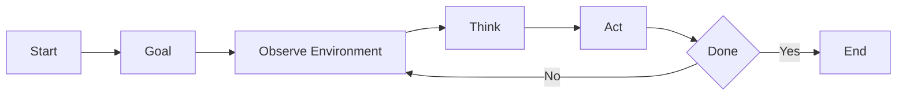
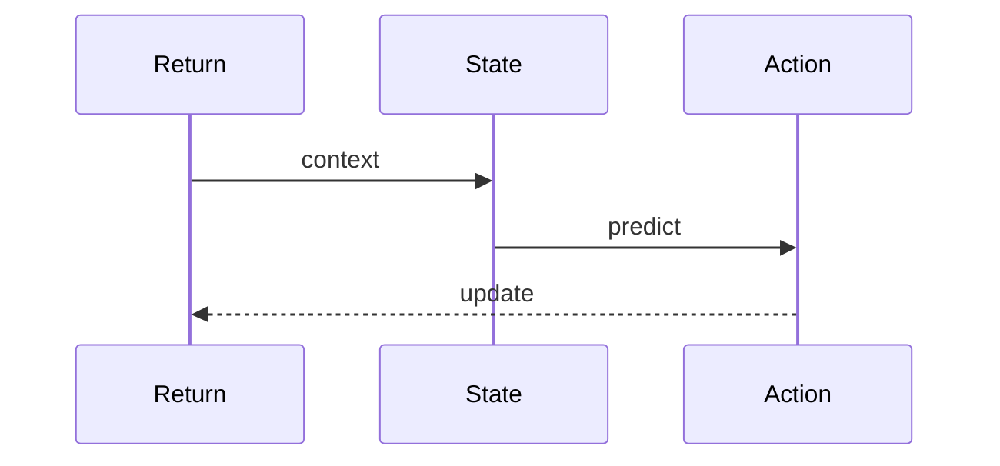
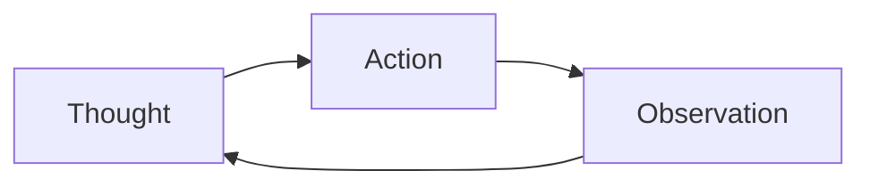
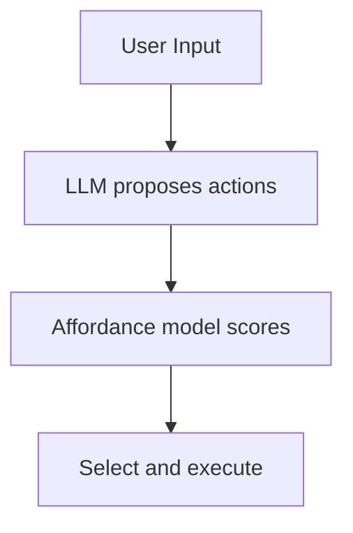
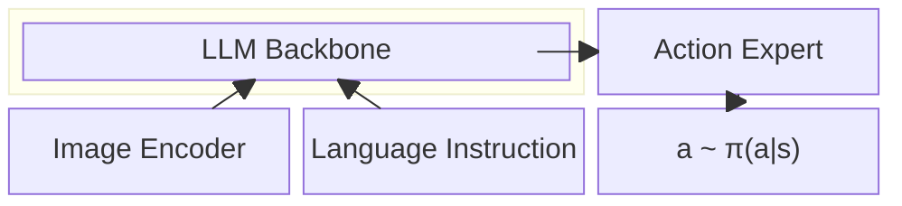
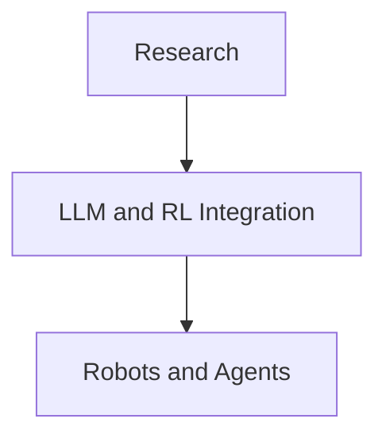

# Introduction

Large Language Models (LLMs) are evolving from text predictors to general-purpose decision engines. This post explores how LLMs are being used for sequential decision making—reasoning, planning, and acting over time in various environments.

# Why LLMs for Decision Making?

Traditional Reinforcement Learning (RL) approaches often struggle with several fundamental challenges:

- **Sparse rewards**: Agents get feedback infrequently, making learning slow and inefficient.
- **Generalization**: Policies don't adapt well to new, unseen tasks—they learn policy $\pi(a|s)$ by optimizing reward but fail to transfer knowledge.
- **Needing vast experience**: Requires millions of interactions to learn even simple behaviors.

LLMs bring a new paradigm to sequential decision making:

- **Inherent World Knowledge**: Pre-trained on vast text data, they "understand" the world, objects, and how tasks are typically performed.
- **Common Sense Reasoning**: Can infer plausible steps to achieve a goal without explicit training.
- **Zero/Few-Shot Planning**: Can generate a sequence of actions for a novel task without specific training.

# The "Brain" of an Agent

The LLM acts as the brain to plan and execute tasks. The typical interaction loop follows these steps:

1. **Goal**: The user provides a high-level goal (e.g., "get me a cup of coffee").
2. **Observe**: The agent perceives its environment (e.g., text description, image).
3. **Think**: The LLM processes the goal and observation to decide the next action.
4. **Act**: The agent executes the action in the environment (e.g., calls an API, controls a robot arm).
5. **Repeat**: The loop continues until the goal is achieved.

# Key Approaches

## Decision Transformer (Chen et al., 2021)

**Core Idea**: Recast reinforcement learning as sequence modeling.

The Decision Transformer treats RL as a sequence modeling problem:
- Input sequence: (Return-to-go, State, Action) tokens.
- Predict next action given context.
- Learns from offline RL datasets.

**Advantages**:
- Simple, model-free approach.
- Compatible with any Transformer architecture.
- Works well on Atari, Gym locomotion tasks.

*Key Takeaway: RL ≈ language modeling over trajectories.*

## ReAct (Yao et al., 2023)

**Goal**: Combine reasoning (Chain-of-Thought) and acting (API calls, environment actions).

ReAct alternates between: Thought → Action → Observation → Repeat. This approach is used for web navigation, QA, and tool use.

*Key takeaway: Enables stepwise reasoning in open-ended tasks.*

## SayCan (Ahn et al., 2022)

SayCan combines an LLM (PaLM) with an affordance model that evaluates the feasibility of robot actions:
- **"Say"** → generate possible actions.
- **"Can"** → rank by feasibility.

The result: robots can perform multi-step, grounded tasks.

## PaLM-E (Driess et al., 2023)

PaLM-E is an embodied multimodal LLM that processes text + vision + continuous state:
- Learns jointly from text, images, and sensor data.
- Used for manipulation, navigation, and visual reasoning.

*Significance: Bridges perception, reasoning, and control.*

## Voyager (Wang et al., 2023) / MineDojo

Voyager is an open-ended agent in Minecraft powered by GPT-4:
- Learns and stores new skills automatically.
- Maintains a library of discovered behaviors.
- Performs lifelong skill acquisition.

*Key Concept: LLM-guided exploration + memory → autonomous long-horizon behavior.*

## Vision-Language-Action Models (VLAs)

A recent breakthrough in robotics is the **Vision-Language-Action (VLA)** paradigm, which directly outputs continuous robot actions from an LLM backbone. The key insight is to have an action expert that outputs continuous action distributions rather than discrete tokens.

*VLA architecture: An LLM backbone processes image encodings and language instructions, with an Action Expert head that outputs continuous action distributions.*

**Key papers in this space**:

- **OpenVLA** ([Kim et al., 2024](https://openvla.github.io/)): Open-source 7B parameter VLA trained on 970k robot trajectories from the Open X-Embodiment dataset. Fine-tunable for specific robots.
- **π₀ (pi-zero)** ([Black et al., 2024](https://www.physicalintelligence.company/blog/pi0)): A flow-matching based VLA from Physical Intelligence that achieves state-of-the-art performance on dexterous manipulation tasks.

**Architecture insights**:
- **LLM Backbone**: Pretrained vision-language model (e.g., Llama, PaliGemma) provides reasoning and world knowledge
- **Action Expert**: Specialized head that outputs action distributions rather than discrete tokens
- **Flow Matching**: Some VLAs use flow matching to model continuous action distributions, avoiding discretization artifacts

**Why this matters**: VLAs bridge the gap between high-level language understanding and low-level motor control, enabling robots to follow natural language instructions while handling the continuous nature of physical actions.

# Limitations: Next-Token Prediction Failures

While LLMs show impressive capabilities, recent work by [Bachmann et al. (2024)](https://arxiv.org/abs/2403.06963) reveals fundamental limitations of next-token prediction for sequential decision making tasks.

*Path-finding tasks expose limitations: LLMs trained with next-token prediction resort to uniform guessing rather than genuine planning—a "Clever Hans" effect where models appear capable but lack true reasoning.*

**Key findings**:
- On graph path-finding tasks, next-token prediction fails to learn the underlying algorithm
- Models exhibit **Clever Hans behavior**: appearing to solve tasks while actually exploiting superficial patterns
- The autoregressive objective biases models toward local token correlations rather than global planning

## Reverse Token Prediction: A Solution

The paper proposes **reverse token prediction** as a key mitigation. Instead of predicting tokens left-to-right (start → goal), the model is trained on reversed sequences (goal → start). This fundamentally changes what the model learns:

- **Forward prediction**: At each step, the model must guess which of many possible next states leads to the goal—an exponentially hard problem
- **Reverse prediction**: Given the goal, work backwards—each step has fewer valid predecessors, making the problem tractable

This highlights a critical gap: while LLMs excel at language tasks, sequential decision making requires reasoning over future states—something standard next-token prediction fundamentally struggles with. Tricks like reverse token prediction and teacherless training can mitigate some of these limitations for certain tasks.

# Comparing Approaches

| Approach | Strength | Limitation |
|----------|----------|------------|
| **Decision Transformer** | Simple, data-efficient offline RL | No explicit reasoning |
| **ReAct** | Interleaves thought + action | Hard to scale to real envs |
| **SayCan** | Grounded robot skills | Requires affordance model |
| **PaLM-E** | Multimodal embodied agent | High compute cost |
| **Voyager** | Lifelong open-ended learning | Limited to game env |
| **Reverse Token Prediction** | Can learn to plan for certain tasks | Not a general solution |

# Future Directions

The field is moving toward:

- Tighter integration with online RL & world models.
- Grounded multi-modal planning (vision, action, text).
- Self-improving autonomous agents.
- Smaller, efficient domain-specific LLMs for decision making.

# Conclusion

Large Language Models are evolving from text predictors to general-purpose decision engines. The ability to reason, plan, and act in natural language and real-world contexts opens up new possibilities for autonomous agents, robotics, and interactive systems.

As the field continues to mature, we can expect to see more sophisticated integrations of LLMs with traditional RL and planning methods, enabling agents that combine the world knowledge of language models with the learning capabilities of reinforcement learning.

# References

1. Chen, L., et al. (2021). Decision Transformer: Reinforcement Learning via Sequence Modeling. https://arxiv.org/abs/2106.01345
2. Yao, S., et al. (2023). ReAct: Synergizing Reasoning and Acting in Language Models. https://arxiv.org/abs/2210.03629
3. Ahn, M., et al. (2022). Do As I Can, Not As I Say: Grounding Language in Robotic Affordances. https://arxiv.org/abs/2204.01691
4. Driess, D., et al. (2023). PaLM-E: An Embodied Multimodal Language Model. https://arxiv.org/abs/2303.03378
5. Wang, G., et al. (2023). Voyager: An Open-Ended Embodied Agent in Minecraft. https://voyager.minedojo.org
6. Bachmann, P., et al. (2024). The pitfalls of next-token prediction. https://arxiv.org/abs/2403.06963